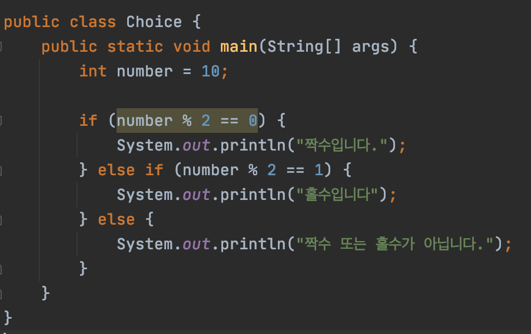
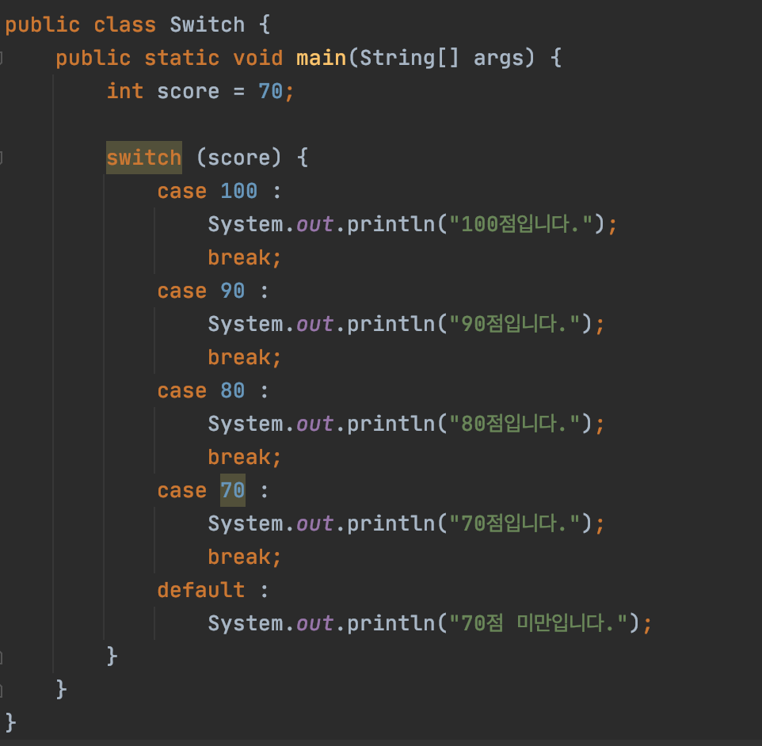
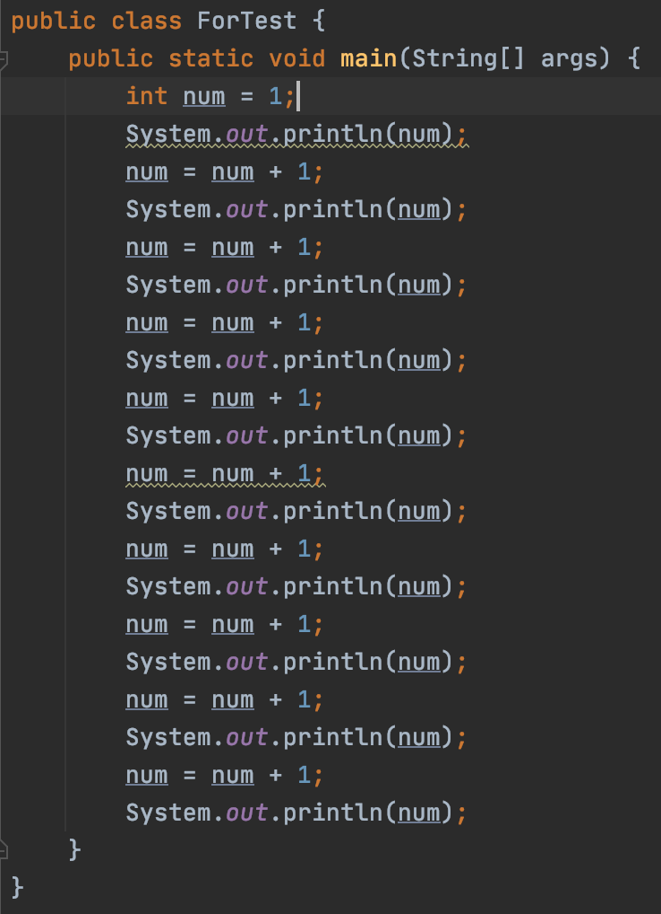
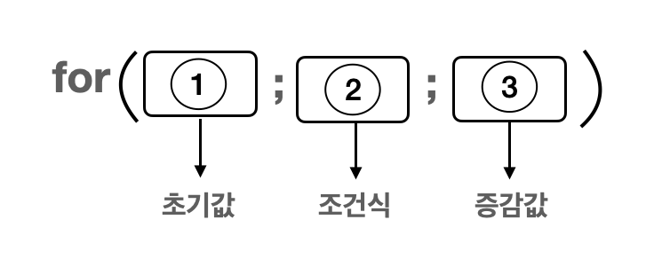
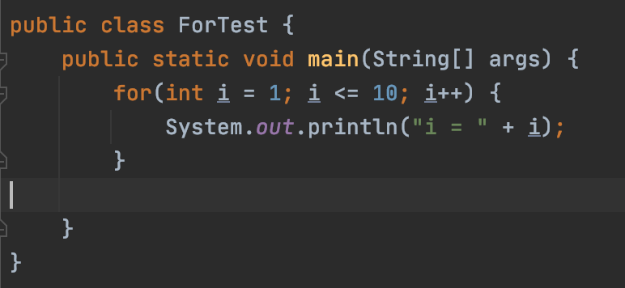
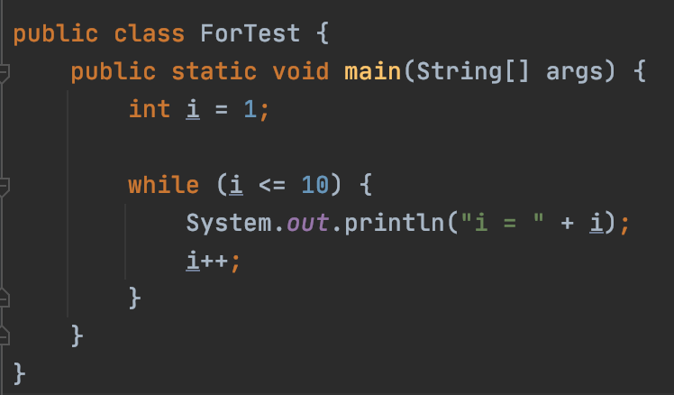

### 1. 선택문

코드를 작성할 때는 상황에 따라 선택적으로 동작을 실행하도록 코드를 작성해야 되는 순간이 있다. 그럴 때 사용하는 것이 선택문으로 if문과 switch문이 있다. 먼저 if문을 알아보자

### 1) if문

**if문**은 if 다음 소괄호 안에 조건(boolean)을 입력하고 **해당 조건이 참일 경우 중괄호 안의 동작을 실행**한다. 여러 조건을 사용하여 선택하고 싶은 경우 else if () 문을 사용하여 조건을 세분화 할 수 있다. 또는 if문 안에 if문을 작성하여 중첩해서 사용할 수도 있지만 중첩이 너무 많이 되는 경우는 가독성도 떨어지고 복잡해지기 때문에 조건을 수정하거나 분리시켜서 줄이는 것이 좋다.

간단하게 해당 숫자가 짝수인지 홀수인지 출력하는 코드를 보자.

1) 만약에 number를 2로 나눈 나머지가 0이면 "짝수입니다" 를 출력한다.

2) 그렇지 않은 경우 number를 2로 나눈 나머지가 1이면 "홀수입니다"를 출력한다.

3) 그 밖의 경우는 "짝수 또는 홀수가 아닙니다" 를 출력한다.

(참고로 if문이 참일 경우 나머지 else if, else문은 실행되지 않는다.)

### 2) switch문

**switch문**은 조건식의 참, 거짓에 따라 실행되는 if문과 달리 **switch 다음 소괄호 () 의 값에 따라 case문이 실행** 되는데 소괄호 안에는 기본형, String, enum 변수 또는 표현식이 들어올 수 있고 case에는 같은 타입의 값으로 입력을 해야 된다.

break를 쓰지 않으면 다음 case로 넘어가기 때문에 써주는 것이 좋고 default는 if문의 나머지를 나타내는 else와 같다. 그리고 다중 if문을 여러개 사용해야 하는 경우 switch문으로 작성하는 것이 가독성이나 속도면에서 효율적이라 경우에 따라 맞게 사용하는 것이 좋다. 

### 2. 반복문

**코드를 작성하다보면 반복적인 동작이 필요할 때**가 있다. 이럴 때 반복적인 코드를 일일이 입력하다 보면 굉장히 비효율적으로 느껴지는데 이럴 때는 **for문, while문이라는 반복문을 사용**하여 해결할 수 있다.  

간단하게 변수 num = 1 값을 1씩 더하면서 10까지 출력하는 코드를 보자.

num 값을 출력하고 1을 더하는 동작을 반복적으로 하고 있다. 만약에 100, 1000까지 출력을 해야 된다면 효율을 떠나 막막해질 것 같다. 위의 반복적인 코드를 for문으로 바꾸어 보자.

**for문**은 다음과 같은 형태로 선언을 하고 일반적으로 **조건식을 충족하는동안 초기값의 변수를 증감시키면서 동작을 반복**한다.     

초기값의 변수는 선언과 동시에 초기값을 할당할 수도 있으며 for문에서 변수를 선언한 경우 해당 변수는 for문 내에서만 유효하다.

**while문**은 for문과 달리 조건식만 입력하고 **조건을 충족하는동안 계속 동작을 반복**하기 때문에 반복 횟수가 정해져 있지 않거나 무수히 많은 경우에 주로 사용한다. 

일반적으로 for문으로 작성한 코드는 while문으로도 작성이 가능하고 while문으로 작성한 코드는 for문으로도 작성이 가능하다.

하지만 **사용 용도에 맞게 사용하는 것이 가독성 면에서 더 좋다.**

