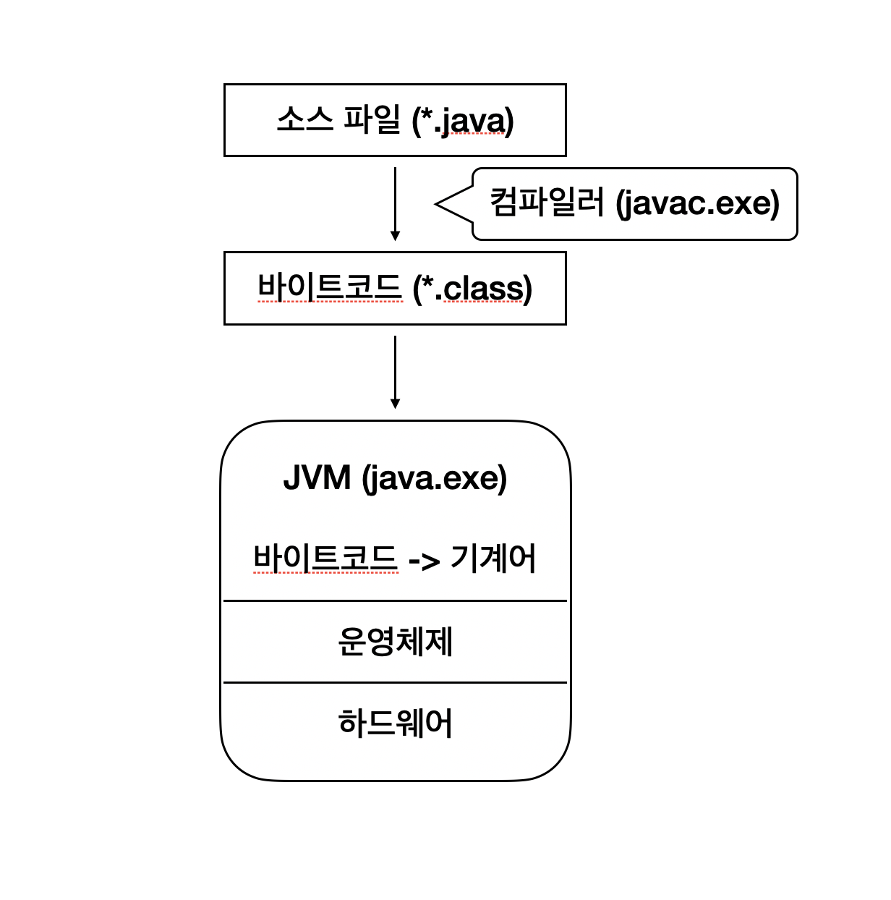
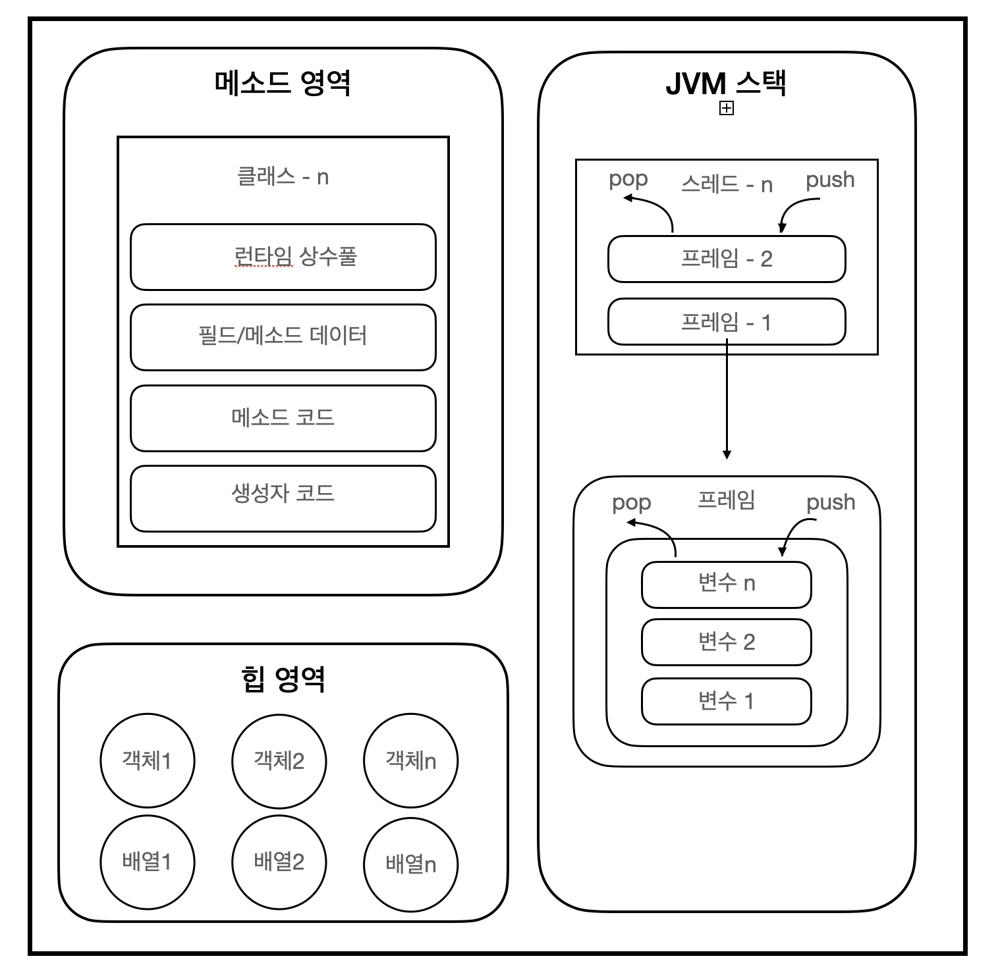

# 자바 스터디 (1주차)


- JVM이란 무엇인가
- 컴파일 하는 방법
- 실행하는 방법
- 바이트코드란 무엇인가
- JIT 컴파일러란 무엇이며 어떻게 동작하는지
- JVM 구성 요소
- JDK와 JRE의 차이


**1. JVM 이란 무엇인가?**

자바 프로그램은 바이트코드로 되어 있어서 이를 실행하려면 중간에서 이 바이트코드를 해석하여 기계어로 바꾸어 주는 프로그램이 별도로 필요합니다. 그리고 바로 **JVM(Java Vertual Machine)** 이 자바 프로그램을 실행하는 일종의 **가상 운영체제** 역할을 합니다. 



**2. 컴파일 하는 방법**

특정 프로그래밍 언어로 작성된 소스 코드를 목적에 맞게 변환시키는 과정을 컴파일이라고 합니다. 자바에서 컴파일을 하는 방법은 먼저 자바 언어로 된 소스 코드(.java)를 작성하고, 다음과 같은 명령을 실행합니다.

```java
javac filename.java
```

 javac는 자바 개발 키드(JDK)에 포함된 자바 컴파일러로, 자바 소스 코드를 입력 받아서 바이트코드(.class)를 생성합니다.


**3. 실행하는 방법**

컴파일 과정을 통해 생성된 바이트코드는 JVM에서 실행을 할 수 있습니다. 다음과 같은 명령으로 실행하며 컴파일을 할 때와 달리 확장자(.class)는 붙이지 않습니다.

```java
java filename
```

JVM은 바이트코드를 해당 운영체제가 이해할 수 있는 기계어로 바꾸어 준 뒤에 실행을 합니다.


**4. 바이트코드란?**

가상 컴퓨터에서 돌아가는 프로그램을 위한 이진 표현법으로 보통 1바이트 크기의 명렁 코드(opcode)이기 때문에 바이트코드라고 부릅니다. 컴퓨터에 조금 더 친화적인 코드로 바뀌기 때문에 소스 코드를 바로 기계어로 번역하는 것보다 더 빠르고 좋은 성능을 보여줍니다. 

**5. JIT 컴파일러란 무엇인가**

프로그램을 실행하는 방식에는 인터프리터 방식과 정적 컴파일 방식 두 가지가 있습니다.

인터프리터 방식은 실행과 동시에 코드를 기계어로 변역을 하고 정적 컴파일 방식은 코드를 먼저 기계어로 번역을 한 뒤에 실행을 시킵니다. 인터프리터 방식은 컴파일을 기다릴 필요 없이 바로 빠르게 실행을 할 수 있다는 장점이 있지만 컴파일을 하고 실행을 하는 정적 컴파일 방식에 비해 느리다는 단점이 있습니다. 

JIT 컴파일 방식은 이 둘의 방식을 혼합한 방식으로 처음에는 인터프리터 방식으로 실행을 하면서 기계어 코드를 생성하는데 이 때 생성되는 코드는 캐시에 저장되어 다시 필요로 할 시에 재컴파일을 하지 않고 바로 사용할 수 있습니다. 그래서 일반적인 인터프리터 방식보다 빠른 속도로 기계어로 변환하며 실행을 하기 때문에  JIT(Just-In-Time) 컴파일러라고 부릅니다.


**6. JVM 구성 요소**

JVM의 구성 요소는 다음과 같습니다.


**1. Class Loader**

JRE에 포함되는 클래스 로더는 클래스 파일들을 로드하여 Runtime Data Area 메모리에 적재하는 역할을 합니다. 요청이 들어오면 라이브러리 안에 포함된 클래스들을 읽어 로드시킵니다.

**2. Execution Engine**

Execution Engine은 클래스 로더에 의해 메모리에 적재된 클래스들을 기계어로 변환하고, 명령어 단위로 실행하는 역할을 합니다. 인터프리터 방식 또는 JIT 방식을 사용합니다.

**3. Garbage Collector(GC)**

Garbage Collector는 메모리 주소를 잃어버려 참조할 수 없는 메모리들을 해제시키는 역할을 해줍니다. 자동적으로 관리해주는 장점이 있지만 메모리 누수가 발생할 위험도 있으므로 경계도 필요합니다.

(GC 상세 링크 : https://velog.io/@litien/가비지-컬렉터GC)

**4. Runtime Data Area (메모리 영역)**



**1) 메소드 영역**

클래스 로더로 읽은 클래스들의 각 데이터를 분류해서 저장합니다. 메소드 영역은 JVM이 시작할 때 생성되고 모든 스레드가 공유하는 영역입니다.

**2) 힙 영역**

객체와 배열이 생성되는 영역으로 해당 객체나 배열을 참조하는 변수나 필드가 없다면 GC에 의해 자동적으로 제거됩니다.

**3) 스택 영역**

각 스레드가 시작될 때 할당되는 스택 영역은 메소드를 호출할 때마다 프레임을 추가하고 메소드가 종료되면 해당 프레임을 제거합니다. 프레임 내부에 있는 로컬 변수 스택은 변수 초기화 시에 변수가 추가되며 해당 블록을 벗어나면 스택에서 제거가 됩니다.

**4) PC 레지스터 **

현재 스레드가 실행되는 부분의 주소와 명령을 저장하고 있습니다.

**5) Native 메소드 스택**

자바는 하드웨어를 직접 제어할 수 없으므로 필요한 경우 다른 언어의 기능을 이용하는데 그 때의 네이티브 코드를 위한 메모리 영역입니다.


**7. JDK와 JRE 차이**

자바 프로그램을 개발하려면 Jave SE(Standard Edition)이 필요합니다. 그리고 Jave SE는 JDK(Java-Development-Kit)와 JRE(Java-Runtime-Environment) 두 가지가 있습니다.

- JDK(자바 개발 키트) = JVM + 라이브러리 API + 개발 도구(컴파일러 등)
- JRE(자바 런타임 환경) = JVM + 라이브러리 API

JDK에는 개발 도구가 포함이 되어 있어 프로그램을 개발할 수 있지만 JRE로는 개발을 할 수 없고 실행만 할 수 있다는 차이점이 있습니다.
