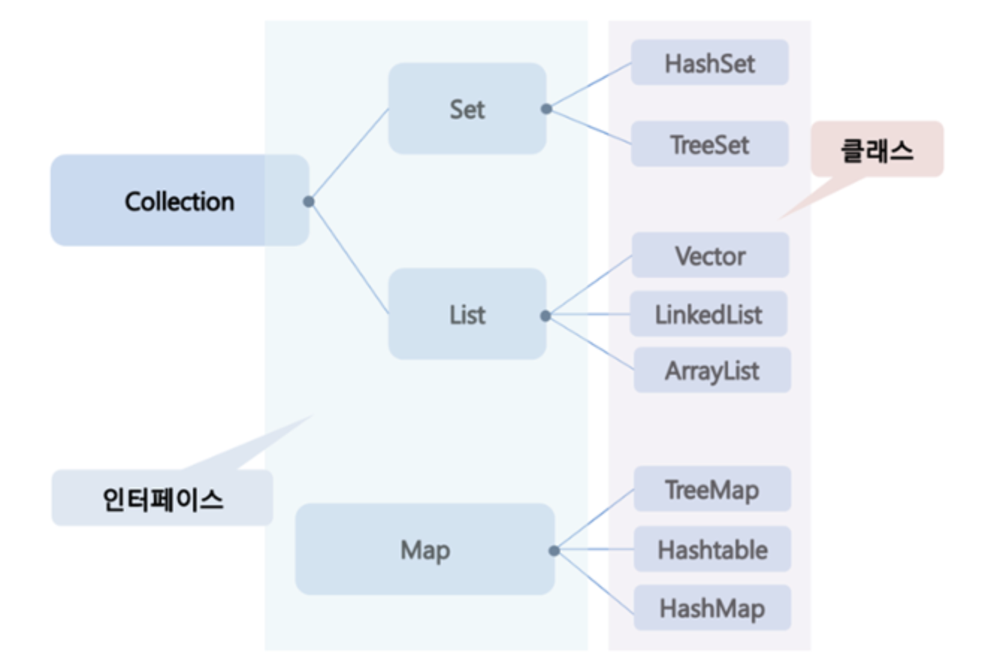

## Generic 과 Collection 

""java 는 자료 구조들을 collection 으로 만들어 제공하기 때문에 collection 은 java 를 사용함에 있어 빼놓을 수 없는 중요한 도구이며 이러한 collection 은 generic 이라는 기법으로 구현되어 있어 generic 에 대한 이해도 필요하다.""

### 1. Generic 이란?

- Generic 이란 데이터의 타입을 일반화 (generalize) 하는 것을 의미한다.
- 클래스나 메소드에서 사용할 내부 데이터 타입을 컴파일 할 시에 미리 지정하는 방법이다.
  - 클래스나 메소드 내부에서 사용되는 객체의 타입 안정성을 높일 수 있다.
  - 반환값에 대한 타입 변환 및 타입 검사에 들어가는 노력을 줄일 수 있다.
- 클래스나 메소드에서 인수의 반환값으로 Object 를 사용하는 경우 반환된 Object 객체를 다시 원하는 타입으로 변환해야 하며 이때 오류가 발생 할 가능성이 존재한다. 하지만 제네릭을 사용하면 컴파일 시에 미리 타입이 정해지므로, 타입 검사나 타입 변환과 같은 작업을 생략할 수 있다.
- 타입 변수 'T' (임의의 참조형 타입), 제네릭 클래스를 생성할 때 사용할 실제 타입을 명시하면, 내부적으로는 정의된 타입 변수가 명시된 실제 타입으로 변환되어 처리된다.

### 2. Collection 이란?

- Collection이란 java 에서 목록성 데이터를 처리하는 자료구조를 뜻한다.
- 일반적으로 배열과 객체를 보관하기 위한 공간을 미리 할당하지 않아도 되므로, 상황에 따라 객체의 수를 동적으로 정할 수 있어 프로그램의 공간적인 효율성 또한 높여준다.
- 데이터를 저장하는 클래스들을 표준화한 설계로 데이터를 저장하는구조에 따라 3가지 인터페이스로 생성된다.

- Set (HashSet)
  - 순서를 유지하지 않는 데이터의 집합 (순서를 보장하기 위해서는 LinkedHashSet을 사용).
  - value 에 대해 중복된 값을 저장하지 않는다.

- List  (ArrayList, LinkedList)
  - 순서를 유지하는 데이터의 집합으로 데이터의 중복이 허용된다.
  - Override 를 통해 List 인터페이스를 직접 정의하여 사용할 수 있다. (ArrayList)
- Map (대표적인 구현체 : HashMap)
  - Key 와 Value 로 이루어진 데이터의 집합
  - 순서는 유지되지 않으며 Key 는 중복을 허락하지 않는다. 

### 3. Iterator (java.util.Iterator)

- Iterator는 위의 Collection 프레임워크에서 저장되어 있는 요소들을 읽어오는 방법을 표준화한 것이다. (Collection 인터페이스가 Iterable 인터페이스를 상속하고 있다.)
- ArrayList 를 탐색할 때 주로 사용되며 객체에 저장된 값을 하나씩 순회할 수 있다.
- List 구조의 컬렉션에서 요소의 순차 검색을 위한 메소드를 포함하고 있다.
- Iterator iter = list.iterator() 
- Iterator 메소드에는 hasNext() -> next(), remove() 가 있다.
  - hasNext() : 읽어올 요소가 남아있는지 확인하는 메소드, 요소가 있으면 true, 없으면 false 리턴
  - next() : 다음 데이터를 반환한다.
  - remove() : next() 로 읽어온 요소를 삭제한다.

