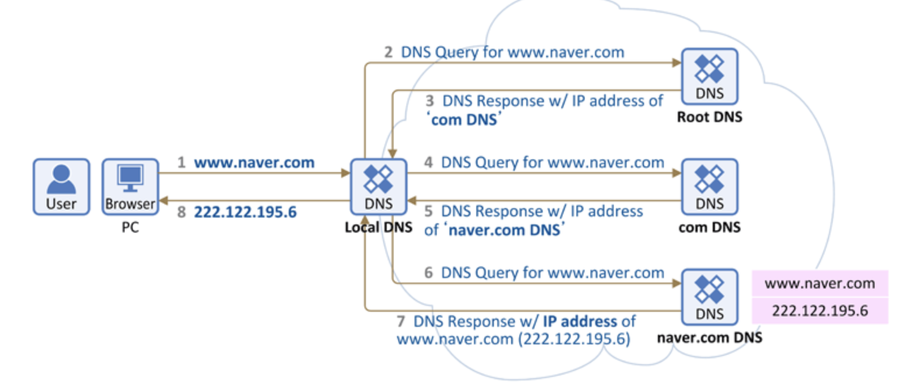

### 1. 호스팅

- **서버 컴퓨터의 전체 혹은 일정 공간을 이용할 수 있도록 임대**해 주는 서비스
- 서버는 24시간 안정적이고 빠른 인터넷 회선과 보안 시스템을 유지해야 하므로 호스팅 서비스를 사용
  - 웹 호스팅 : 호스팅 업체의 통합 관리를 받아 하나의 서버를 여러 고객이 함께 사용 (가격 저렴, 하드웨어 제한적)
  - 서버 호스팅 : 하나의 서버를 하나의 고객이 사용 (높은 비용, 빠른 데이터 속도, 직접적인 서버 운영/관리 권한)
  - 클라우드 서버 : 서버 호스팅을 가상화 한 서버 (고객 단독 사용, 서버 용량에 유연, 문제 발생시 연쇄 위험)

### 2. 도메인 네임 (= 호스트명)

- 사람이 외우기 어려운 숫자 형태의 IP 주소를 사람이 기억하기 쉬운 **문자 형태로 표현한 주소**.
- 네트워크 상에서 각각의 컴퓨터를 식별할 수 있게 해주는 **호스트명**.

**URL 구성 : https:// [domain name] / [path] / [file name]**

### 3. 도메인 네임 시스템 (DNS)

- **도메인 네임과 해당 IP 주소를 한 쌍으로 저장**하고 있는 **분산형 데이터 베이스** 시스템
- 호스트의 도메인 네임을 **컴퓨터가 인식할 수 있는 네트워크 주소로 변환**해주는 역할.

#### DNS 동작 원리 (Recursive Query)

**Local DNS 서버가 여러 DNS 서버를 차례대로 돌면서 답을 찾는 방법**

(출처 : https://judo0179.tistory.com/37)

1. 브라우저에 도메인 주소를 입력했을 때, PC는 ***L*ocal DNS에게 IP 주소를 요청**.
2. Local DNS에 호스트 네임에 대한 정보가 없을 경우 **각 Root DNS(전세계 13대)에 요청**.
3. 해당 Root DNS 에 호스트에 대한 정보가 없으면 하위 DNS Server에 요청
4. 데이터를 찾으면 **IP 주소에 대한 결과를 반환**
5. Local DNS 는 도메인 주소에 대한 **IP 주소를 캐싱하고 클라이언트에 전달**

