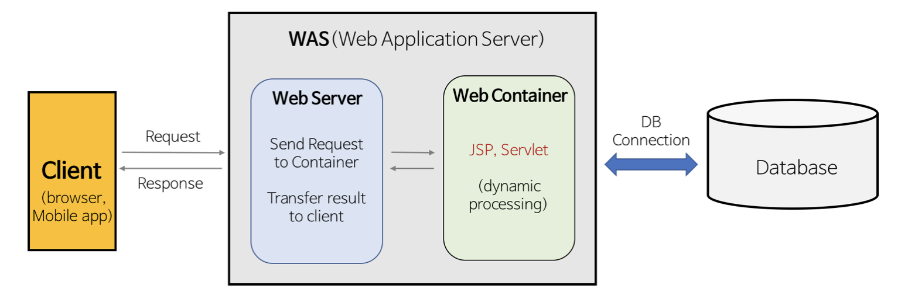

### 1. 웹 서버

- **하드웨어**와 **소프트웨어**로 구분. (Apache, Nginx, IIS 등)

​	1) **하드웨어 :** 웹 서버가 설치되어 있는 컴퓨터

​	2) **소프트웨어 :** 웹 클라이언트로부터 HTTP 요청을 받고 **정적인 컨텐츠(html, css등)를 제공**하는 프로그램

-  http 프로토콜을 기반으로 클라이언트의 요청을 서비스
  - 정적 컨텐츠 - WAS를 거치지 않고 바로 자원 제공
  - 동적 컨텐츠 - 클라이언트 요청을 WAS에 보내고, WAS에서 처리한 결과를 클라이언트에게 전달

* 웹 서버의 필요성
  * 기능 분배를 해서 서버 부담 감소(정적 컨텐츠 담당)
  * 정적 파일을 애플리케이션 서버까지 가지 않고 앞단에서 빠르게 전송

### 2. WAS (Web Application Server)

- **DB 조회 및 다양한 로직 처리** 요구시 동적인 컨텐츠를 제공하기 위해 만들어진 Application Server

- http를 통해 Application을 수행해주는 미들웨어 (프로그램 실행 환경 및 DB 접속 기능 제공)

- **웹 컨테이너(Container)** 또는 **서블릿(Servlet) 컨테이너**라고도 불림
  - **컨테이너 :** JSP, Servlet을 실행시킬 수 있는 소프트웨어. (즉, WAS는 JSP, Servlet 구동 환경 제공)
- 웹 서버의 기능들을 구조적으로 분리하여 처리하는 역할 (웹 서버 + 웹 컨테이너)
  - 보안, **스레드 처리, 분산 트랜잭션** 등 **분산 환경에서 사용**(보통 DB 서버와 함께 사용)
- WAS의 필요성
  - 필요한 데이터를 DB에서 가져와 비즈니스 로직에 맞게 그때마다 결과를 만들어 제공하면서 자원을 효율적으로 사용할 수 있음.

