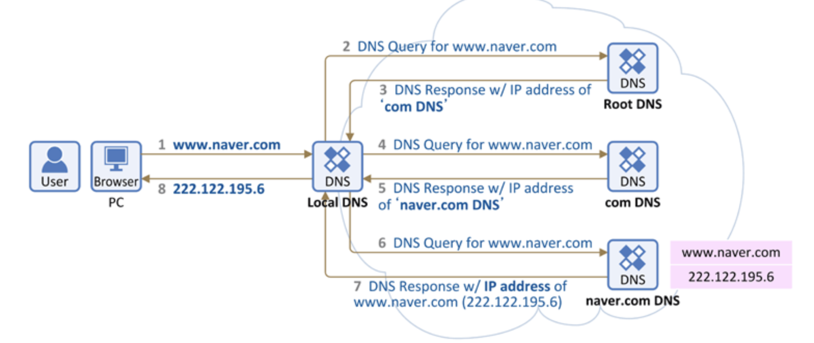

### 1. IP 주소

- 네트워크 환경에서 **컴퓨터(노드) 간 통신**하기 위해 각 컴퓨터에 부여된 **네트워크 주소**.
- IP 통신에 필요한 고유 주소로 **IPv4, IPv6** 두 가지 체계 사용
  - **IPv4 :** 32bit 주소 체계, 8bit씩(= 옥테드) 끊어 0 ~ 255의 10진수 숫자로 표현, 각 옥테드는 dot으로 구분. 
  - **IPv6 :** 128bit 주소 체계, IPv4 의 부족으로 IPv6 의 사용이 점차 확대

### 2. 호스팅

- **서버 컴퓨터의 전체 혹은 일정 공간을 이용할 수 있도록 임대**해 주는 서비스
- 서비스를 운영하는데 필요한 콘텐츠의 **저장 공간**.
- 서버는 24시간 안정적이고 빠른 인터넷 회선과 보안 시스템을 갖춰야 하므로 호스팅 서비스를 사용.

### 3. 도메인 네임 (= 호스트명)

- 사람이 외우기 어려운 숫자 형태의 IP 주소를 사람이 기억하기 쉬운 **문자 형태로 표현한 주소**.
- 네트워크 상에서 각각의 컴퓨터를 식별할 수 있게 해주는 **호스트명**.

**URL 구성 : https (protocol) :// (host) / (path) / (filename)**

### 4. 도메인 네임 시스템 (DNS)

- **도메인 네임과 해당 IP 주소를 한 쌍으로 저장**하고 있는 분산형 **데이터 베이스** 시스템
- 호스트의 도메인 네임을 호스트의 **컴퓨터가 인식할 수 있는 네트워크 주소로 변환**해주는 역할.

#### DNS 동작 원리 (Recursive Query)

**Local DNS 서버가 여러 DNS 서버를 차례대로 돌면서 답을 찾는 방법**

(출처 : https://judo0179.tistory.com/37)

1. 브라우저에 도메인 주소를 입력했을 때, PC는 ***L*ocal DNS에게 IP 주소를 요청**.
2. Local DNS에 호스트 네임에 대한 정보가 없을 경우 **각 Root DNS(전세계 13대)에 요청**.
3. 해당 Root DNS 에 호스트에 대한 정보가 없으면 다른 DNS Server에 요청
4. 데이터를 찾으면 **IP 주소에 대한 결과를 반환**
5. Local DNS 는 도메인 주소에 대한 **IP 주소를 캐싱하고 클라이언트에 전달**

